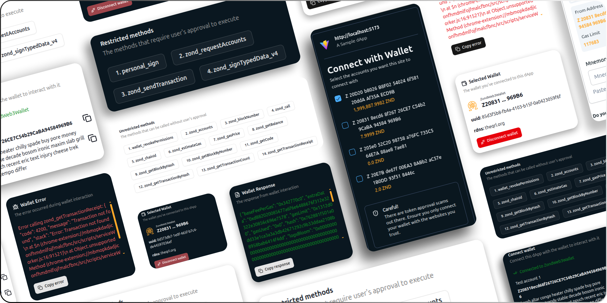

# Zond Web3 Wallet dApp Example

A dApp web application for demonstrating the connectivity(based on EIP-6963) to the Zond Web3 Wallet web extension.

The application renders the following sections:

- **Wallets Detected:** Displays all the wallets(supporting EIP-6963) installed in the browser in an expandable form. The wallet's icon and name is displayed. To connect to a wallet, click on the connect button of the desired wallet. On connecting to a wallet, all the restricted methods(which requires user's approval to execute) and unrestricted methods(which doesn't require user's approval) will be listed on the screen.
- **Selected Wallet:** This section will be visible only when the wallet is connected. On successfully connecting to a wallet, the wallet name, connected account address, uuid and rdns are displayed in this section.
- **Wallet Response:** This section will be visible only when the wallet is connected. On successfully completing a request, the response is displayed here.
- **Wallet Error:** This section will be visible only when the wallet is connected. For a failed or unsuccessful request, the error is displayed here.

## :keyboard: Run locally

- Run `git clone https://github.com/theQRL/zond-web3-wallet-dapp-example.git` for cloning this repo to your machine.
- Run `npm install` for installing all dependencies of this project.
- Run `npm run dev` to run the application locally. By default, the application will be running at `http://localhost:5173/`.

## :link: JSON-RPC API details

Communication between a dApp and Zond Web3 Wallet happens via JSON-RPC API requests.

### Restricted Methods

The methods when called, asks for user approval before executing. A request screen will be presented with an option to either approve or reject the request.

| No. | Method                                            |
| --- | ------------------------------------------------- |
| 1   | [personal_sign](#1-personal_sign)                 |
| 2   | [zond_requestAccounts](#2-zond_requestaccounts)   |
| 3   | [zond_sendTransaction](#3-zond_sendTransaction)   |
| 4   | [zond_signTypedData_v4](#4-zond_signTypedData_v4) |

#### 1. personal_sign

A method that presents a plain text signature challenge to the user and returns the signed response and the public key for verification. The parameters are hex-encoded UTF-8 challenge string and the address of the requesting account.

- ##### Request

> ```typescript
> const signedData = await provider.request({
>   method: "personal_sign",
>   params: [
>     "0x506c65617365207369676e2074686973206d65737361676520746f20636f6e6669726d20796f7572206964656e746974792e",
>     "Z208318ecd68f26726CE7C54b29CaBA94584969B6",
>   ],
> });
> ```

- ##### Response

> ```json
> {
>   "signature": "0x0087c28d899155115254bbd....",
>   "publicKey": "0x04bfcabf8c1b1a5a7e25f9b...."
> }
> ```

#### 2. zond_requestAccounts

A method that prompts the user to connect their Zond account(s) with the dApp.

- ##### Request

> ```typescript
> const accounts = await provider.request({
>   method: "zond_requestAccounts",
>   params: [],
> });
> ```

- ##### Response

> ```json
> [
>   "Z208318ecd68f26726CE7C54b29CaBA94584969B6",
>   "Z20E7Bde67f00EA38ABb2aC57e1B0DD93f518446c"
> ]
> ```

#### 3. zond_sendTransaction

A method that prompts the user to make a transaction like ZND transfer, contract deployment and contract interaction.

- ##### Request

> ```typescript
> const txHash = await provider.request({
>   method: "zond_sendTransaction",
>   params: [
>     {
>       to: "Z20E7Bde67f00EA38ABb2aC57e1B0DD93f518446c",
>       from: "Z208318ecd68f26726CE7C54b29CaBA94584969B6",
>       gas: "0x51bc",
>       value: "0x33",
>       data: "0x",
>       gasPrice: "0x777",
>     },
>   ],
> });
> ```

- ##### Response

> ```json
> "0x3e306b5a5a37532e1734503f7d2427a86f2c992fbe471f5be403b9f734e661c5"
> ```

#### 4. zond_signTypedData_v4

A method that presents a data message for the user to sign in a structured and readable format and returns the signature and the public key.

- ##### Request

> ```typescript
> const signedData = await provider.request({
>   method: "zond_signTypedData_v4",
>   params: [
>     "Z208318ecd68f26726CE7C54b29CaBA94584969B6"
>     {
>       types: {
>           EIP712Domain: [....],
>           Person: [....],
>           Mail: [....],
>       },
>       primaryType: "Mail",
>       domain: {
>           name: "Ether Mail",
>           version: "1",
>           chainId: 1,
>           verifyingContract: "ZDeaDbeefdEAdbeefdEadbEEFdeadbeEFdEaDbeeF",
>       },
>       message: {
>           from: {
>               name: "Last",
>               wallet: "ZCD2a3d9F938E13CD947Ec05AbC7FE734Df8DD826",
>           },
>           to: {
>               name: "Genesis",
>               wallet: "ZbBbBBBBbbBBBbbbBbbBbbbbBBbBbbbbBbBbbBBbB",
>           },
>           contents: "Hello, Genesis!",
>       },
>     },
>   ],
> });
> ```

- ##### Response

> ```json
> {
>   "signature": "0x0087c28d899155115254bbd....",
>   "publicKey": "0x04bfcabf8c1b1a5a7e25f9b...."
> }
> ```

### Unrestricted Methods

The methods when called, silently gives back response without needing any interaction from the user.

| No. | Method                                                                                   |
| --- | ---------------------------------------------------------------------------------------- |
| 1   | [wallet_revokePermissions](#1-wallet_revokePermissions)                                  |
| 2   | [web3_clientVersion](#2-web3_clientVersion)                                              |
| 3   | [zond_accounts](#3-zond_accounts)                                                        |
| 4   | [zond_blockNumber](#4-zond_blockNumber)                                                  |
| 5   | [zond_call](#5-zond_call)                                                                |
| 6   | [zond_chainId](#6-zond_chainId)                                                          |
| 7   | [zond_estimateGas](#7-zond_estimateGas)                                                  |
| 8   | [zond_feeHistory](#8-zond_feeHistory)                                                    |
| 9   | [zond_gasPrice](#9-zond_gasPrice)                                                        |
| 10  | [zond_getBalance](#10-zond_getBalance)                                                   |
| 11  | [zond_getBlockByHash](#11-zond_getBlockByHash)                                           |
| 12  | [zond_getBlockByNumber](#12-zond_getBlockByNumber)                                       |
| 13  | [zond_getBlockTransactionCountByHash](#13-zond_getBlockTransactionCountByHash)           |
| 14  | [zond_getBlockTransactionCountByNumber](#14-zond_getBlockTransactionCountByNumber)       |
| 15  | [zond_getCode](#15-zond_getCode)                                                         |
| 16  | [zond_getFilterChanges](#16-zond_getFilterChanges)                                       |
| 17  | [zond_getFilterLogs](#17-zond_getFilterLogs)                                             |
| 18  | [zond_getLogs](#18-zond_getLogs)                                                         |
| 19  | [zond_getProof](#19-zond_getProof)                                                       |
| 20  | [zond_getStorageAt](#20-zond_getStorageAt)                                               |
| 21  | [zond_getTransactionByBlockHashAndIndex](#21-zond_getTransactionByBlockHashAndIndex)     |
| 22  | [zond_getTransactionByBlockNumberAndIndex](#22-zond_getTransactionByBlockNumberAndIndex) |
| 23  | [zond_getTransactionByHash](#23-zond_getTransactionByHash)                               |
| 24  | [zond_getTransactionCount](#24-zond_getTransactionCount)                                 |
| 25  | [zond_getTransactionReceipt](#25-zond_getTransactionReceipt)                             |
| 26  | [zond_newBlockFilter](#26-zond_newBlockFilter)                                           |
| 27  | [zond_subscribe](#27-zond_subscribe)                                                     |
| 28  | [zond_syncing](#28-zond_syncing)                                                         |
| 29  | [zond_unsubscribe](#29-zond_unsubscribe)                                                 |

#### 1. wallet_revokePermissions

A method for revoking the previously approved permissions for the dApp.

- ##### Request

> ```typescript
> await provider.request({
>   method: "wallet_revokePermissions",
>   params: [
>     {
>       zond_accounts: {},
>     },
>   ],
> });
> ```

- ##### Response

> ```json
> null
> ```

#### 2. web3_clientVersion

A method for returning the current Zond client version.

- ##### Request

> ```typescript
> const currentVersion = await provider.request({
>   method: "web3_clientVersion",
>   params: [],
> });
> ```

- ##### Response

> ```json
> "Gzond/v0.2.1-stable-c50ef86d/linux-amd64/go1.22.12"
> ```

#### 3. zond_accounts

A method that returns the list of accounts that the user has approved to connect.

- ##### Request

> ```typescript
> const accounts = await provider.request({
>   method: "zond_accounts",
>   params: [],
> });
> ```

- ##### Response

> ```json
> ["Z20B714091cF2a62DADda2847803e3f1B9D2D3779"]
> ```

#### 4. zond_blockNumber

A method that returns the number of most recent block.

- ##### Request

> ```typescript
> const blockNumber = await provider.request({
>   method: "zond_blockNumber",
>   params: [],
> });
> ```

- ##### Response

> ```json
> "0x3345"
> ```

#### 5. zond_call

A method for creating a new message call immediately.

- ##### Request

> ```typescript
> const result = await provider.request({
>   method: "zond_call",
>   params: [
>     {
>       to: "Z20E7Bde67f00EA38ABb2aC57e1B0DD93f518446c",
>       value: "0x7",
>     },
>     "latest",
>   ],
> });
> ```

- ##### Response

> ```json
> "0x"
> ```

#### 6. zond_chainId

A method for returning the chain ID of the current network.

- ##### Request

> ```typescript
> const chainId = await provider.request({
>   method: "zond_chainId",
>   params: [],
> });
> ```

- ##### Response

> ```json
> "0x7e7e"
> ```

#### 7. zond_estimateGas

A method for calculating the estimate of how much gas is necessary for the transaction.

- ##### Request

> ```typescript
> const gas = await provider.request({
>   method: "zond_estimateGas",
>   params: [
>     {
>       from: "Z208318ecd68f26726CE7C54b29CaBA94584969B6",
>       to: "Z20B714091cF2a62DADda2847803e3f1B9D2D3779",
>       value: "0x7",
>     },
>   ],
> });
> ```

- ##### Response

> ```json
> "0x5208"
> ```

#### 8. zond_feeHistory

A method that returns the transaction base fee per gas and effective priority fee per gas for a given block range.

- ##### Request

> ```typescript
> const feeHistory = await provider.request({
>   method: "zond_feeHistory",
>   params: ["0x3", "latest", [10, 50]],
> });
> ```

- ##### Response

> ```json
> {
>   "oldestBlock": "0x17185",
>   "reward": [
>     ["0x0", "0x0"],
>     ["0x0", "0x0"],
>     ["0x0", "0x0"]
>   ],
>   "baseFeePerGas": ["0x7", "0x7", "0x7", "0x7"],
>   "gasUsedRatio": [0, 0, 0]
> }
> ```

#### 9. zond_gasPrice

A method for returning the current price per gas.

- ##### Request

> ```typescript
> const gas = await provider.request({
>   method: "zond_gasPrice",
>   params: [],
> });
> ```

- ##### Response

> ```json
> "0x3b9aca07"
> ```

#### 10. zond_getBalance

A method for returning the balance of the given account.

- ##### Request

> ```typescript
> const balance = await provider.request({
>   method: "zond_getBalance",
>   params: ["Z208318ecd68f26726CE7C54b29CaBA94584969B6", "latest"],
> });
> ```

- ##### Response

> ```json
> "0x6cfe56f3795885980005"
> ```

#### 11. zond_getBlockByHash

A method for returning information about a block by hash.

- ##### Request

> ```typescript
> const blockInformation = await provider.request({
>   method: "zond_getBlockByHash",
>   params: [
>     "0x7daca88be141b9c778aa2d55ae81eab7766e97a9b2549e975680a6f20dd46fde",
>     false,
>   ],
> });
> ```

- ##### Response

> ```json
> {
>   "baseFeePerGas":"0x7",
>   "extraData":"0xd882020085677a6f6e6488676f312e32322e30856c696e7578",
>   "gasLimit":"0x1312d00",
>   "gasUsed":"0x0",
>   "hash":"0x7daca88be141b9c778aa2d55ae81eab7766e97a9b2549e975680a6f20dd46fde",
>   ....
> }
> ```

#### 12. zond_getBlockByNumber

A method that returns the block information by number.

- ##### Request

> ```typescript
> const block = await provider.request({
>   method: "zond_getBlockByNumber",
>   params: ["0x324c", false],
> });
> ```

- ##### Response

> ```json
> {
>   "number": "0x68b3",
>   "hash": "0xd5f1812548be429cbdc6376b29611fc49e06f1359758c4ceaaa3b393e2239f9c",
>   "mixHash": "0x24900fb3da77674a861c428429dce0762707ecb6052325bbd9b3c64e74b5af9d",
>   "parentHash": "0x1f68ac259155e2f38211ddad0f0a15394d55417b185a93923e2abe71bb7a4d6d",
>   "nonce": "0x378da40ff335...."
>   ....
> }
> ```

#### 13. zond_getBlockTransactionCountByHash

A method for returning the number of transactions in a block from a block matching the given block hash.

- ##### Request

> ```typescript
> const transactionCount = await provider.request({
>   method: "zond_getBlockTransactionCountByHash",
>   params: [
>     "0x762881f501a0dd33e1ca3a3a3db42671292c9b33ddaa2108b8958bab6414f4dd",
>   ],
> });
> ```

- ##### Response

> ```json
> "0x8"
> ```

#### 14. zond_getBlockTransactionCountByNumber

A method for returning the number of transactions in a block matching the given block number.

- ##### Request

> ```typescript
> const transactionCount = await provider.request({
>   method: "zond_getBlockTransactionCountByNumber",
>   params: ["0x17187"],
> });
> ```

- ##### Response

> ```json
> "0x8"
> ```

#### 15. zond_getCode

A method for returning the code at a given address.

- ##### Request

> ```typescript
> const code = await provider.request({
>   method: "zond_getCode",
>   params: ["Z208318ecd68f26726CE7C54b29CaBA94584969B6", "latest"],
> });
> ```

- ##### Response

> ```json
> "0x60806040526004361060485763ffffffff7c01000000000000000000000000000000000000000000000000000000006000350416633fa4f2458114604d57806355241077146071575b600080fd5b348015605857600080fd5b50605f6088565b60408051918252519081900360200190f35b348015607c57600080fd5b506086600435608e565b005b60005481565b60008190556040805182815290517f199cd93e851e4c78c437891155e2112093f8f15394aa89dab09e38d6ca0727879181900360200190a1505600a165627a7a723058209d8929142720a69bde2ab3bfa2da6217674b984899b62753979743c0470a2ea70029"
> ```

#### 16. zond_getFilterChanges

A method for polling the filter with the given ID (created using zond_newFilter). It returns an array of logs which occurred since last poll.

- ##### Request

> ```typescript
> const logObjects = await provider.request({
>   method: "zond_getFilterChanges",
>   params: ["0x5d71077f43bcd46f25b74f2409d2f164"],
> });
> ```

- ##### Response

> ```json
> [
>   {
>     "logIndex": "0x0",
>     "removed": false,
>     "blockNumber": "0x233",
>     "blockHash": "0xfc139f5e2edee9e9c888d8df9a2d2226133a9bd87c88ccbd9c930d3d4c9f9ef5",
>     "topics": [
>       "0x04474795f5b996ff80cb47c148d4c5ccdbe09ef27551820caa9c2f8ed149cce3"
>     ],
>     ....
>   },
>   {
>     "logIndex": "0x0",
>     "removed": false,
>     "blockNumber": "0x238",
>     "blockHash": "0x98b0ec0f9fea0018a644959accbe69cd046a8582e89402e1ab0ada91cad644ed",
>     "topics": [
>       "0x04474795f5b996ff80cb47c148d4c5ccdbe09ef27551820caa9c2f8ed149cce3"
>     ],
>     ....
>   }
> ]
> ```

#### 17. zond_getFilterLogs

A method for returning an array of all logs matching the filter with the given ID (created using zond_newFilter).

- ##### Request

> ```typescript
> const logObjects = await provider.request({
>   method: "zond_getFilterLogs",
>   params: ["0x1c2fc22a03559852c88e0b501792be88"],
> });
> ```

- ##### Response

> ```json
> [
>   {
>     "logIndex": "0x0",
>     "removed": false,
>     "blockNumber": "0x233",
>     "blockHash": "0xfc139f5e2edee9e9c888d8df9a2d2226133a9bd87c88ccbd9c930d3d4c9f9ef5",
>     "topics": [
>       "0x04474795f5b996ff80cb47c148d4c5ccdbe09ef27551820caa9c2f8ed149cce3"
>     ],
>     ....
>   },
>   {
>     "logIndex": "0x0",
>     "removed": false,
>     "blockNumber": "0x238",
>     "blockHash": "0x98b0ec0f9fea0018a644959accbe69cd046a8582e89402e1ab0ada91cad644ed",
>     "topics": [
>       "0x04474795f5b996ff80cb47c148d4c5ccdbe09ef27551820caa9c2f8ed149cce3"
>     ],
>     ....
>   }
> ]
> ```

#### 18. zond_getLogs

A method for returning an array of all logs matching the specified filter.

- ##### Request

> ```typescript
> const log = await provider.request({
>   method: "zond_getLogs",
>   params: [
>     {
>       fromBlock: "0x1234AB",
>       toBlock: "latest",
>       address: "0xd01aaa39b223fe8d0a0e5c4f27ead9083c756dd3",
>       topics: [],
>     },
>   ],
> });
> ```

- ##### Response

> ```json
> [
>   {
>     "logIndex": "0x0",
>     "removed": false,
>     "blockNumber": "0x233",
>     "blockHash": "0xfc139f5e2edee9e9c888d8df9a2d2226133a9bd87c88ccbd9c930d3d4c9f9ef5",
>     "topics": [
>       "0x04474795f5b996ff80cb47c148d4c5ccdbe09ef27551820caa9c2f8ed149cce3"
>     ],
>     ....
>   },
>   {
>     "logIndex": "0x0",
>     "removed": false,
>     "blockNumber": "0x238",
>     "blockHash": "0x98b0ec0f9fea0018a644959accbe69cd046a8582e89402e1ab0ada91cad644ed",
>     "topics": [
>       "0x04474795f5b996ff80cb47c148d4c5ccdbe09ef27551820caa9c2f8ed149cce3"
>     ],
>     ....
>   }
> ]
> ```

#### 19. zond_getProof

A method that returns the merkle proof for a given account and optionally some storage keys.

- ##### Request

> ```typescript
> const accountProof = await provider.request({
>   method: "zond_getProof",
>   params: ["Z20D20b8026B8F02540246f58120ddAAf35AECD9B", [], "latest"],
> });
> ```

- ##### Response

> ```json
> {
>   "accountProof": [
>     "0xf90191a05b49406cc....",
>     "0xf851808080a0eeafb....",
>     "0xf874a02082e4c4652...."
>   ],
>   "balance": "0x1a77e254760c9d13ccacd",
>   "codeHash": "0xc5d2460186f7233c927e7db2dcc703c0e500b653ca82273b7bfad8045d85a470",
>   "nonce": "0xb",
>   "storageHash": "0x56e81f171bcc55a6ff8345e692c0f86e5b48e01b996cadc001622fb5e363b421",
>   "storageProof": []
> }
> ```

#### 20. zond_getStorageAt

A method for returning the information about a transaction requested by transaction hash.

- ##### Request

> ```typescript
> const storageAt = await provider.request({
>   method: "zond_getStorageAt",
>   params: ["Z20D20b8026B8F02540246f58120ddAAf35AECD9B", "0x0", "latest"],
> });
> ```

- ##### Response

> ```json
> "0x0000000000000000000000000000000000000000000000000000000000000000"
> ```

#### 21. zond_getTransactionByBlockHashAndIndex

A method for returning information about a transaction by block hash and transaction index position.

- ##### Request

> ```typescript
> const transactionInformation = await provider.request({
>   method: "zond_getTransactionByBlockHashAndIndex",
>   params: [
>     "0x28e25a85fe327cea53e461774d989181e71595ce653e193f96836242ae8b8f48",
>     "0x2",
>   ],
> });
> ```

- ##### Response

> ```json
> {
>   "blockHash": "0x510efccf44a192e6e34bcb439a1947e24b86244280762cbb006858c237093fda",
>   "blockNumber": "0x442",
>   "chainId": 345,
>   "from": "Z205fe2f3af6c04C415A82CA456588640435C9746"
>   ....
> }
> ```

#### 22. zond_getTransactionByBlockNumberAndIndex

A method for returning information about a transaction by block number and transaction index position.

- ##### Request

> ```typescript
> const transactionInformation = await provider.request({
>   method: "zond_getTransactionByBlockNumberAndIndex",
>   params: [
>     "0x28e25a85fe327cea53e461774d989181e71595ce653e193f96836242ae8b8f48",
>     "0x2",
>   ],
> });
> ```

- ##### Response

> ```json
> {
>   "blockHash": "0x510efccf44a192e6e34bcb439a1947e24b86244280762cbb006858c237093fda",
>   "blockNumber": "0x442",
>   "chainId": 345,
>   "from": "Z205fe2f3af6c04C415A82CA456588640435C9746"
>   ....
> }
> ```

#### 23. zond_getTransactionByHash

A method for returning the information about a transaction requested by transaction hash.

- ##### Request

> ```typescript
> const tx = await provider.request({
>   method: "zond_getTransactionByHash",
>   params: [
>     "0xa52be92809541220ee0aaaede6047d9a6c5d0cd96a517c854d944ee70a0ebb44",
>   ],
> });
> ```

- ##### Response

> ```json
> {
>   "blockHash": "0x510efccf44a192e6e34bcb439a1947e24b86244280762cbb006858c237093fda",
>   "blockNumber": "0x442",
>   "chainId": 345,
>   "from": "Z205fe2f3af6c04C415A82CA456588640435C9746"
>   ....
> }
> ```

#### 24. zond_getTransactionCount

A method for returning the code at a given address.

- ##### Request

> ```typescript
> const transactionCount = await provider.request({
>   method: "zond_getTransactionCount",
>   params: ["Z20E7Bde67f00EA38ABb2aC57e1B0DD93f518446c", "latest"],
> });
> ```

- ##### Response

> ```json
> "0x1"
> ```

#### 25. zond_getTransactionReceipt

A method for returning the receipt of a transaction by transaction hash.

- ##### Request

> ```typescript
> const tx = await provider.request({
>   method: "zond_getTransactionReceipt",
>   params: [
>     "0x504ce587a65bdbdb6414a0c6c16d86a04dd79bfcc4f2950eec9634b30ce5370f",
>   ],
> });
> ```

- ##### Response

> ```json
> {
>   "blockHash": "0xe7212a92cfb9b06addc80dec2a0dfae9ea94fd344efeb157c41e12994fcad60a",
>   "blockNumber": "0x77",
>   "contractAddress": null,
>   "cumulativeGasUsed": "0x5208",
>   "from": "Z20B714091cF2a62DADda2847803e3f1B9D2D3779"
>   ....
> }
> ```

#### 26. zond_newBlockFilter

A method that creates a filter in the node, to notify when a new block arrives.

- ##### Request

> ```typescript
> const filterIdentifier = await provider.request({
>   method: "zond_newBlockFilter",
>   params: [],
> });
> ```

- ##### Response

> ```json
> "0x01"
> ```

#### 27. zond_subscribe

A method that subscribes to specific Ethereum events, returning a subscription ID used to receive notifications. A unique subscription ID that can be used to unsubscribe or identify incoming notifications will be returned.

- ##### Request

> ```typescript
> const subscriptionId = await provider.request({
>   method: "zond_syncing",
>   params: [
>     "logs",
>     {
>       address: "Z208318ecd68f26726CE7C54b29CaBA94584969B6",
>       topics: [
>         "0xddf252ad1be2c89b69c2b068fc378daa952ba7f163c4a11628f55a57b7edb8d6",
>       ],
>     },
>   ],
> });
> ```

- ##### Response

> ```json
> "0xbb0ecff80c39d75faac664a6dff7c43a"
> ```

#### 28. zond_syncing

A method that returns an object with data about the sync status or false.

- ##### Request

> ```typescript
> const syncingStatus = await provider.request({
>   method: "zond_syncing",
>   params: [],
> });
> ```

- ##### Response

> ```json
> false
> ```

#### 29. zond_unsubscribe

A method that unsubscribes from a specific Ethereum event, using the subscription ID provided by zond_subscribe method.

- ##### Request

> ```typescript
> const unsubscribed = await provider.request({
>   method: "zond_unsubscribe",
>   params: ["0xbb0ecff80c39d75faac664a6dff7c43a"],
> });
> ```

- ##### Response

> ```json
> true
> ```
